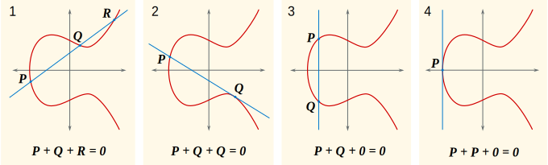

# [#32436](https://github.com/bitcoin/bitcoin/pull/32436) test: refactor: negate signature-s using libsecp256k1
_All code comments in `[]` are my own._

This is a refactor change to a unit test utility function for negating the `S`
of a signature, previously some homegrown negation was performed, and after this
PR functionality from libsecp256k1 will be reused. The descriptions that follow
are not of a problem that exists in the old code, they are just general
background on what it means to negate `S`.

---

This account is simplified and deliberately avoids complications like `k`, but
I think is sufficient to understand the issue here.

ECDSA signatures suffer from a form of malleability that is an inherent property
of elliptic curve addition.

If you take two points at random on an elliptic curve, $a$ and $b$ and draw a
line through them, that line will usually intersect the curve at a third point,
$c$. There are two exceptions where this is not the case, one is when you have a
line that is tangent to the curve, and the other is when the line is vertical,
or $a.x == b.x$ and $a.y = -b.y$, but I'll return to this.

When you "add" two points on an elliptic curve, you draw a line through the two
points and find the third point that intersects the curve, $c$, and then you
reflect across the x-axis, aka draw a vertical line, aka negate this point $C$
and get $-C$ and that is your sum.



### Negation / Identity property

The identity member of the set of natural numbers is 0, since for any member $x$:

$$ x + 0 = x $$

And this constrains, or includes the definition of negativity since it requires
that:

$$ x + (-x) = 0 $$

On the elliptic curve, this refers to the "vertical line" situation, the third
point of such a sum is said to be the point at infinity, and this is the
identity member. Thinking back on the earlier account, that the sum of two
points, $A$ and $B$ is the reflection of the third point $C$ over the x-axis,
$-C$, we find something strange, but coherent with this identity property, the
sum of any point $A$ and "0", or the identity point, is the point $A$, because
the third point is $-A$, and then you reflect over  the x-axis and get $A$.

The only operation defined is addition, but out of this we get multiplication by
positive scalars, since that is just repeated addition, and we indirectly get
multiplication by negative scalars, because the identity property gives us a way
to negate a point, so we can do $A * -6$, by doing $-A * 6$

Some of that was unnecessary exposition, but here's the crux

When verifying a signature $s$, which is a scalar, we will multiply it by some
point on the elliptic curve, let's say $A$, which has some special mathematical
connection to another point $R$, whose x-coordinate is $r$, (like I said above, wrong, but just accurate
enough to make the point that I believe is relevant here), 


## The old

`NegateSignatureS` takes a DER-encoded signature `vchSig`, and negates the S

```cpp
void static NegateSignatureS(std::vector<unsigned char>& vchSig) {
    // Parse the signature.
    std::vector<unsigned char> r, s;
    r = std::vector<unsigned char>(vchSig.begin() + 4, vchSig.begin() + 4 + vchSig[3]);
    s = std::vector<unsigned char>(vchSig.begin() + 6 + vchSig[3], vchSig.begin() + 6 + vchSig[3] + vchSig[5 + vchSig[3]]);

    // Really ugly to implement mod-n negation here, but it would be feature creep to expose such functionality from libsecp256k1.
    static const unsigned char order[33] = {
        0x00,
        0xFF, 0xFF, 0xFF, 0xFF, 0xFF, 0xFF, 0xFF, 0xFF,
        0xFF, 0xFF, 0xFF, 0xFF, 0xFF, 0xFF, 0xFF, 0xFE,
        0xBA, 0xAE, 0xDC, 0xE6, 0xAF, 0x48, 0xA0, 0x3B,
        0xBF, 0xD2, 0x5E, 0x8C, 0xD0, 0x36, 0x41, 0x41
    };
    while (s.size() < 33) {
        s.insert(s.begin(), 0x00);
    }
    int carry = 0;
    for (int p = 32; p >= 1; p--) {
        int n = (int)order[p] - s[p] - carry;
        s[p] = (n + 256) & 0xFF;
        carry = (n < 0);
    }
    assert(carry == 0);
    if (s.size() > 1 && s[0] == 0 && s[1] < 0x80) {
        s.erase(s.begin());
    }

    // Reconstruct the signature.
    vchSig.clear();
    vchSig.push_back(0x30);
    vchSig.push_back(4 + r.size() + s.size());
    vchSig.push_back(0x02);
    vchSig.push_back(r.size());
    vchSig.insert(vchSig.end(), r.begin(), r.end());
    vchSig.push_back(0x02);
    vchSig.push_back(s.size());
    vchSig.insert(vchSig.end(), s.begin(), s.end());
}
```

## The new


